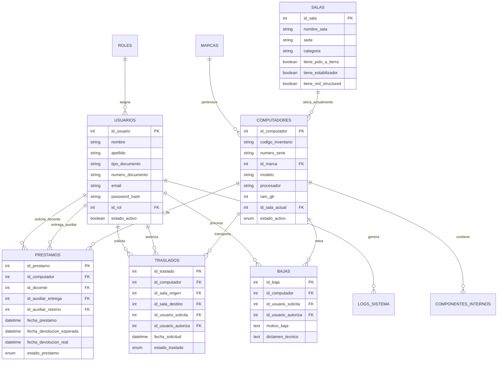

# Diagrama de Flujo de Información y Arquitectura de Datos - INVENTORI

**Proyecto de Grado**: Sistema de Gestión de Inventario, Préstamos, Traslados y Bajas de Equipos de Cómputo para Laboratorios.  
**Arquitectura**: Modelo-Vista-Controlador (MVC) en PHP 8.x + MySQL (PDO) + Frontend Dinámico AJAX / Web Components.

---

## 1. Visión General de la Arquitectura del Sistema

El flujo de información en **INVENTORI** sigue el patrón de diseño **MVC (Model-View-Controller)** con separación estricta de responsabilidades entre tres capas principales:

```
+-----------------------------------------------------------------------------------+
|                            CAPA 1: INTERFAZ DE USUARIO (UI)                       |
|   [Login]  [Dashboard]  [Computadores]  [Préstamos]  [Traslados]  [Bajas]  [Salas] |
+----------------------------------------+------------------------------------------+
                                         |  Peticiones HTTP (GET/POST/AJAX)
                                         v
+-----------------------------------------------------------------------------------+
|                        CAPA 2: LÓGICA DE NEGOCIO (CONTROLLERS)                    |
|   Router -> AuthMiddleware -> [Controllers: Prestamo, Computador, Traslado...]    |
|   - Validaciones de reglas de negocio   - Auditoría de Logs   - Sanitización      |
+----------------------------------------+------------------------------------------+
                                         |  Sentencias SQL Preparadas (PDO)
                                         v
+-----------------------------------------------------------------------------------+
|                     CAPA 3: PERSISTENCIA DE DATOS (DATABASE)                      |
|   MySQL: [usuarios] [computadores] [salas] [prestamos] [traslados] [bajas] [logs] |
+-----------------------------------------------------------------------------------+
```

---

## 2. Flujo de Información por Módulo de Negocio

### 2.1 Módulo de Préstamos de Equipos (Loans Workflow)

1. **Interfaz de Usuario (`app/views/prestamos/create.php`)**:
   - El Auxiliar/Docente selecciona un computador en estado **Disponible**, el docente responsable, la fecha estimada de retorno y observaciones.
   - Evento JavaScript emite la solicitud al controlador.
2. **Lógica de Negocio (`app/controllers/PrestamoController.php`)**:
   - `create()` recibe la petición `POST`.
   - Verifica autenticación y permisos del usuario.
   - Ejecuta validaciones:
     - Comprueba que el equipo `id_computador` esté marcado como `estado_activo = 'Disponible'`.
     - Valida la existencia del docente `id_docente`.
   - Llama a `Prestamo::create($data)` dentro de una transacción.
3. **Persistencia y Base de Datos (`app/models/Prestamo.php` & MySQL)**:
   - Insert en tabla `prestamos` con `estado_prestamo = 'Activo'`.
   - Update en tabla `computadores`: cambia `estado_activo = 'En Prestamo'`.
   - Insert en tabla `logs_sistema`: registra la acción realizada por el auxiliar con su IP y timestamp.

---

### 2.2 Módulo de Traslados de Equipos entre Salas (Hardware Transfers)

1. **Interfaz de Usuario (`app/views/traslados/create.php`)**:
   - El usuario solicita mover un computador de su `id_sala_origen` a una nueva `id_sala_destino` con un motivo especificado.
2. **Lógica de Negocio (`app/controllers/TrasladoController.php`)**:
   - `store()` captura la solicitud.
   - Comprueba que `id_sala_origen` sea diferente de `id_sala_destino`.
   - Si la solicitud es aprobada por un Administrador (`autorizar($id)`):
     - Llama al modelo `Traslado::aprobar($id_traslado, $id_usuario_autoriza)`.
3. **Persistencia y Base de Datos (`app/models/Traslado.php` & MySQL)**:
   - Update en tabla `traslados`: actualiza `estado_traslado = 'Aprobado'` y guarda `id_usuario_autoriza`.
   - Update en tabla `computadores`: actualiza atómicamente `id_sala_actual = id_sala_destino`.
   - Registro automático en `logs_sistema`.

---

### 2.3 Módulo de Bajas Técnicas (Hardware Decommissioning)

1. **Interfaz de Usuario (`app/views/bajas/create.php`)**:
   - Formulario de solicitud de baja por obsolescencia o daño físico con adjunto de dictamen técnico.
2. **Lógica de Negocio (`app/controllers/BajaController.php`)**:
   - Verifica el dictamen técnico y autorizaciones.
3. **Persistencia y Base de Datos (`app/models/Baja.php` & MySQL)**:
   - Insert en tabla `bajas` con dictamen técnico y usuario responsable.
   - Update en tabla `computadores`: cambia `estado_activo = 'Dado de Baja'`. El equipo queda inhabilitado para préstamos y traslados futuros.

---

## 3. Modelo Entidad-Relación de Base de Datos (ERD Diagram)



---

## 4. Conclusiones para la Sustentación de Grado

- **Seguridad e Integridad**: La información nunca pasa directamente de la vista a la base de datos. Se aplican PDO Prepared Statements contra inyecciones SQL y validaciones previas en la capa Controller.
- **Trazabilidad de Activos**: Cada cambio de estado de un computador (de disponible a prestado, trasladado o dado de baja) genera un historial inmutable visible en la auditoría del sistema.
- **Eficiencia Operativa**: Reducción del tiempo de asignación de laboratorios y préstamo de equipos con alertas visuales de estado.
